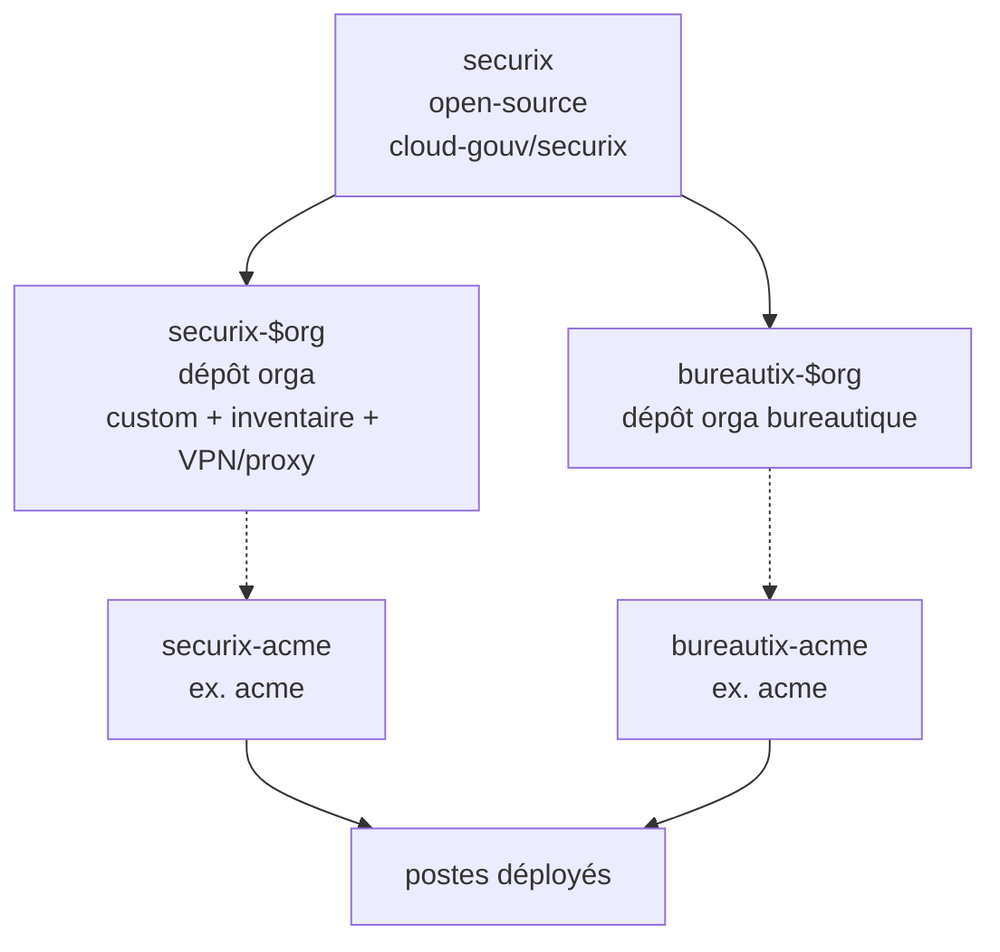

<!--
SPDX-FileCopyrightText: 2026 Ryan Lahfa <ryan.lahfa@numerique.gouv.fr>

SPDX-License-Identifier: CC-BY-SA-4.0
-->

# Contexte

Le projet SécurixOS est un projet de kit de fabrication de poste de travail, qu'ils soient d'administration ou qu'ils soient de bureautique et tout ce qu'il y a entre les deux en matière de nuance de postes de travail, e.g. poste métier spécialisé, poste durci nomade, etc.

Le projet met à contribution le projet NixOS qui est lui-même un kit de fabrication de distributions Linux héritant des concepts de Nix [1] et le spécialise à des fins de fabrication de postes de travail géré de façon organisationnel.

Le projet SécurixOS n'adresse pas les besoins de postes de travail dans les milieux BYOD ("Bring Your Own Device"), il n'adresse que les postes maîtrisés sous le contrôle d'une entité centralisée au sein d'une organisation. Il est bien sûr possible d'avoir la gestion de plusieurs souches SécurixOS sous différentes branches au sein d'une même organisation, si cela est nécessaire.

Puisque SécurixOS est un kit de fabrication, il ne donne pas accès à des artéfacts d'installation « sur étagère » comme les distributions Linux classiques, il n'est donc pas possible de télécharger un ISO de SécurixOS pour l'essayer car il faudrait fabriquer une organisation factice et avoir une infrastructure de postes de travail de démonstration.

Néanmoins, le projet SécurixOS propose des dépôts de code à titre d'exemple pour voir **une** façon d'intégrer le kit SécurixOS pour pouvoir obtenir des artéfacts en tout genre: ISOs, systèmes à copier sur le disque, images de machines virtuelles, etc.

Le projet SécurixOS fait l'hypothèse que les personnes qui vont s'en emparer disposent déjà d'une compréhension de l'écosystème Nix ou NixOS, il n'est pas conseillé d'utiliser SécurixOS sans compétences Nix au sein de son organisation.

## La distinction entre `securix` et `securix-$org` ou `bureautix-$org`

Dans le projet SécurixOS, nous conseillons de garder une référence vers le projet open source et de mettre en commun les efforts dans le commun numérique lorsque votre besoin pourrait bénéficier à tout le monde. Lorsque votre besoin est très spécifique à votre organisation ou en expérimentation, il est préférable de le garder pour vous et de le maturer. En plus, le projet SécurixOS propose plein de mécanismes permettant de contrôler les politiques appliqués pour générer les postes de travail de votre organisation. Ces informations doivent être stockés dans un dépôt de code, nous les appelons les dépôts `securix-$org` (si vous utilisez une variante poste d'administration) ou `bureautix-$org` (si vous utilisez une variante bureautique), on y trouve :

* vos personnalisations spécifiques à votre organisation
* vos expérimentations
* vos inventaires statiques
* vos éléments de configuration VPNs
* vos éléments de configuration de proxy

Par exemple, si votre organisation `acme` décide de déployer un poste d'administration et un poste de bureautique (deux populations, parfois qui se recoupent) sous la gestion de deux divisions différentes, vous pouvez construire alors `securix-acme` et `bureautix-acme` et ils feront tous les deux référence au projet open source <https://github.com/cloud-gouv/securix>. Il est bien entendu possible de faire un miroir de ce projet sur votre forge et de dépendre de la version en miroir.

Ainsi, pour la montée de version, il existe deux composants majeurs à gérer :

* NixOS & nixpkgs qui fait l'objet d'une mise à jour tous les 6 mois si vous suivez les versions stables ou toutes les semaines si vous suivez les versions continues
* SécurixOS qui fait l'objet d'un développement au fil de l'eau et maintient les composants de sécurité qui ne sont pas dans nixpkgs, e.g. lanzaboote pour Secure Boot ou disko pour le partitionnement du disque.
